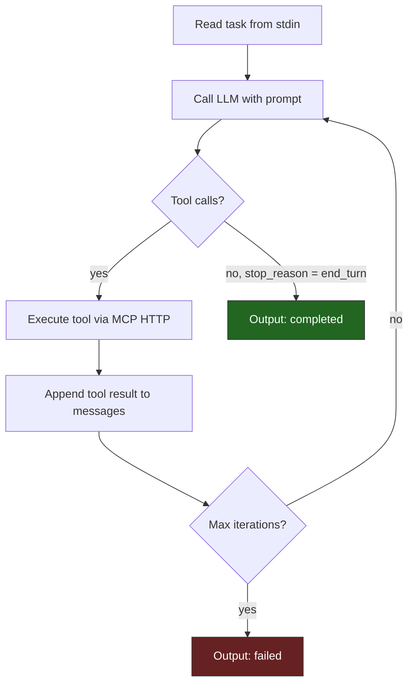

# JudgementD

Reference agent implementation for the sandbox system. Reads a structured task from stdin, calls an LLM (Anthropic Claude via [GhostProxy](https://github.com/Travbz/GhostProxy)), executes MCP tool calls, iterates until done, and writes structured output to stdout. Follows the platform's agent contract so it works inside any sandbox provisioned by [CommandGrid](https://github.com/Travbz/CommandGrid).

## System overview

| Repo | What it does |
|---|---|
| **[CommandGrid](https://github.com/Travbz/CommandGrid)** | Orchestrator -- config, secrets, provisioning, tools, memory |
| **[GhostProxy](https://github.com/Travbz/GhostProxy)** | Credential-injecting LLM reverse proxy with token metering |
| **[RootFS](https://github.com/Travbz/RootFS)** | Container image -- entrypoint, env stripping, privilege drop |
| **[api-gateway](https://github.com/Travbz/api-gateway)** | Customer-facing REST API -- job submission, SSE streaming, billing |
| **[ToolCore](https://github.com/Travbz/ToolCore)** | MCP tool monorepo -- spec, reference tools |
| **[JudgementD](https://github.com/Travbz/JudgementD)** | This repo -- reference agent |

---

## Agent contract

The agent follows a strict I/O contract so the control plane can run any conforming agent in a sandbox.

### Input (stdin)

A JSON object piped to stdin:

```json
{
  "task_id": "job-abc123",
  "prompt": "Summarize the contents of /workspace",
  "system_prompt": "You are a helpful assistant.",
  "tools": [
    {
      "name": "echo",
      "transport": "http",
      "endpoint": "http://echo:8080",
      "schema": "{...}"
    }
  ],
  "max_iterations": 10
}
```

### Output (stdout)

A JSON object written to stdout when done:

```json
{
  "status": "completed",
  "result": "The workspace contains three Go packages...",
  "usage": { "input_tokens": 1200, "output_tokens": 450 }
}
```

### Exit codes

| Code | Meaning |
|---|---|
| `0` | Success (`status: "completed"`) |
| `1` | Failure (`status: "failed"` or `"error"`) |

### Environment variables

| Variable | Source | Purpose |
|---|---|---|
| `ANTHROPIC_API_KEY` | CommandGrid (session token) | Auth for LLM calls |
| `ANTHROPIC_BASE_URL` | CommandGrid (proxy URL) | Routes calls through GhostProxy |
| `TOOL_ENDPOINTS` | CommandGrid | Comma-separated `name=url` pairs |

---

## How the agent loop works



1. Read task JSON from stdin
2. Build initial messages from prompt + system prompt + context
3. Call the LLM (Anthropic Messages API via proxy)
4. If the response contains `tool_use` blocks, execute each tool call via HTTP
5. Append tool results to message history, loop back to step 3
6. If the LLM returns `end_turn`, extract the final text and write output to stdout
7. If max iterations exceeded, write a failure output

---

## Tool execution

Tools listed in the task input are called via HTTP:

```
POST http://<tool-name>:<port>/call
Content-Type: application/json

{"message": "hello", "loud": true}
```

The agent discovers tools from the `tools` array in the task input. Each entry includes the tool's name, endpoint URL, transport type, and JSON schema.

---

## Building

```bash
go build -o judgementd .
```

No external dependencies -- the agent uses only the standard library and raw HTTP for both LLM calls and tool calls.

---

## Running standalone

```bash
echo '{"task_id":"test","prompt":"Say hello"}' | \
  ANTHROPIC_API_KEY=sk-ant-... \
  ANTHROPIC_BASE_URL=http://localhost:8090 \
  ./judgementd
```

In production, the control plane handles all of this -- the agent binary just needs to be present in the sandbox image.

---

## Project structure

```
JudgementD/
├── main.go       # agent loop, LLM client, tool execution, contract types
└── go.mod
```
